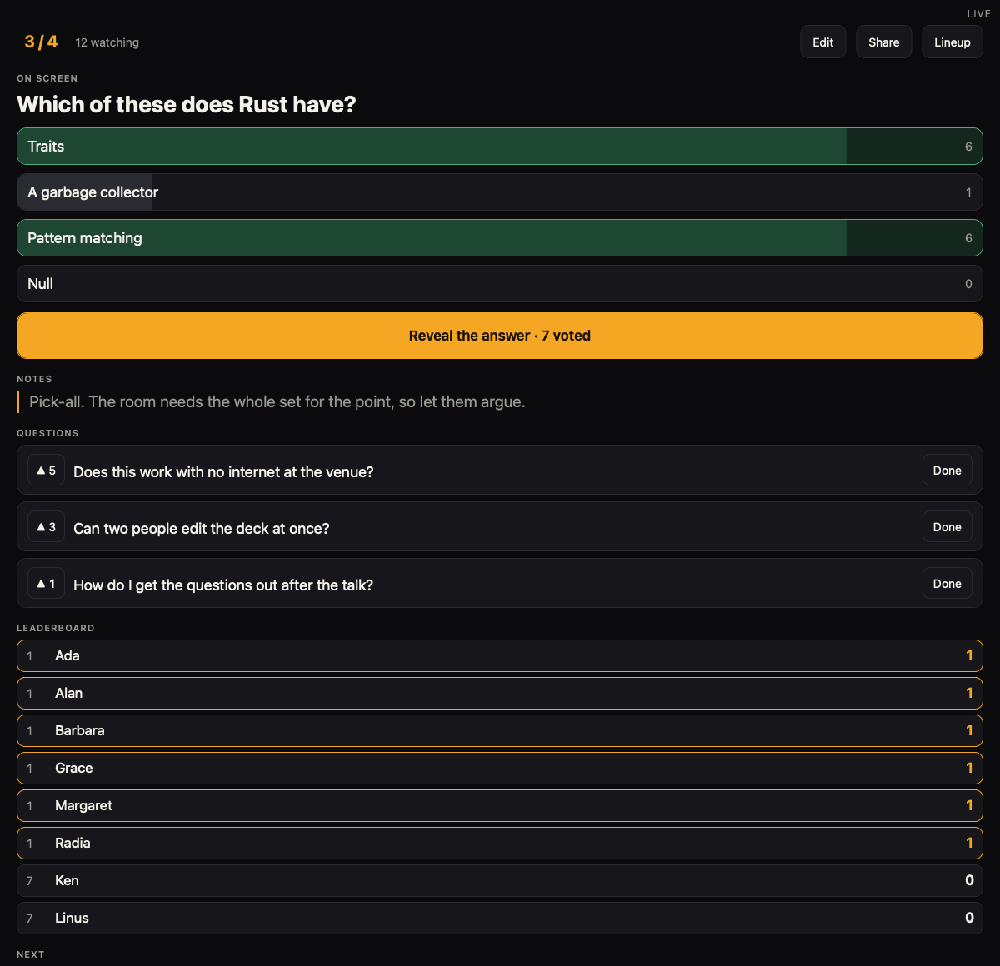
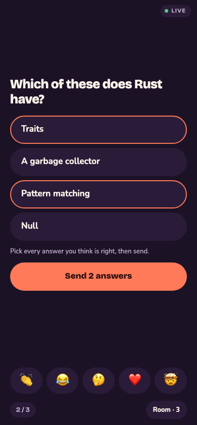
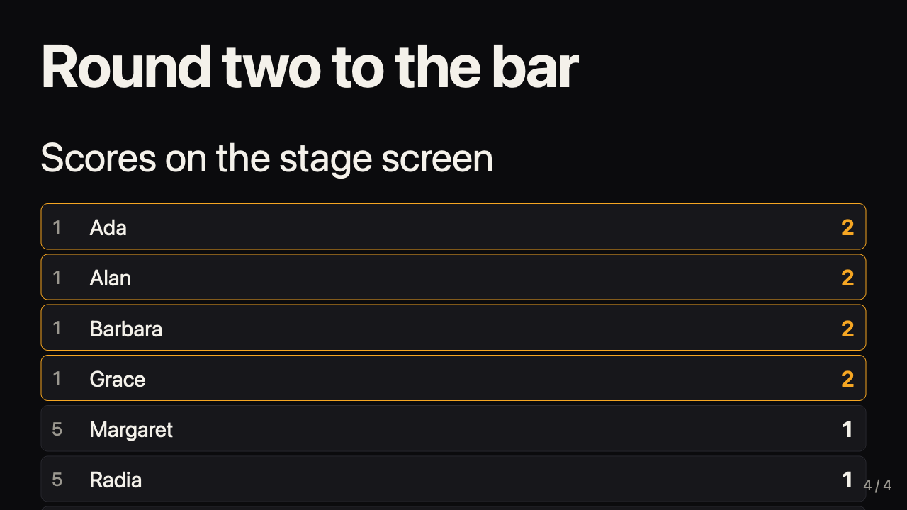
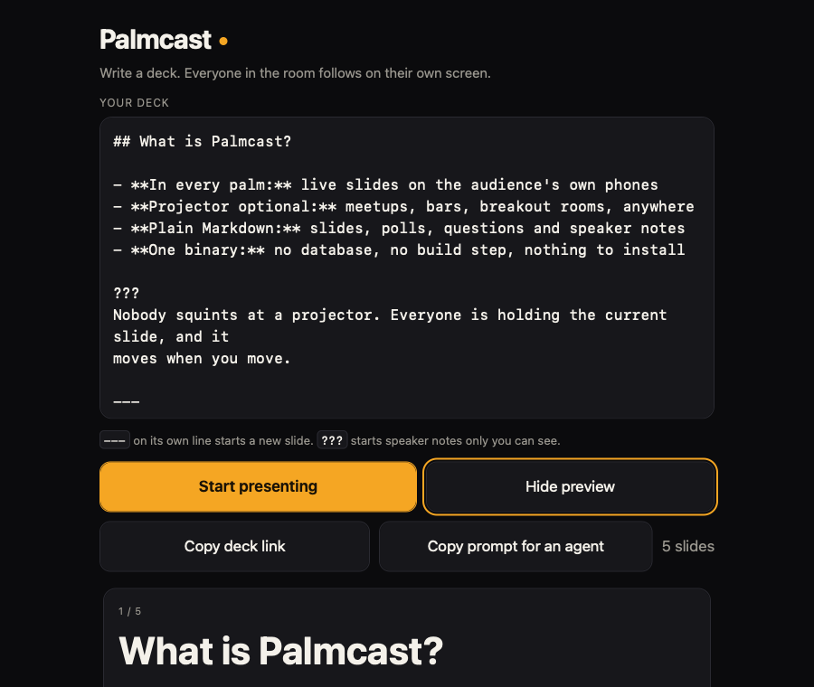
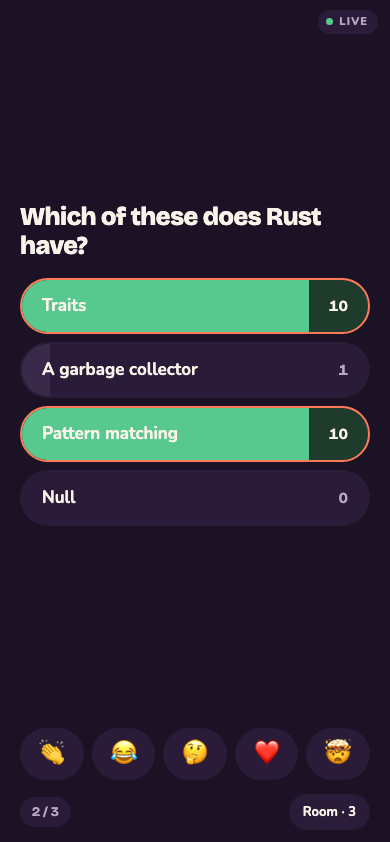

# Palmcast

Live slides on every screen in the room. The presenter drives from a phone, and
the audience follows on their own phones. No projector is required, and one
binary serves the whole room.

Palmcast suits a talk where nobody brought a laptop: a meetup at a bar, a
lightning talk, a quiz night. Write a deck in Markdown, share a QR code, and
every phone in the room stays on your current slide. The room can vote on quiz
questions, react, and ask questions back.



The presenter console. The tally and the right answer stay on this screen until
the presenter opens them.

## Overview

One session holds one deck. Whoever writes the deck controls it, and everyone
else watches. The session has three views:

| View | Path | Who opens it |
|---|---|---|
| Presenter | `/s/<id>/present` | The person driving. Shows notes and the next slide. |
| Personal | `/s/<id>` | The audience, on their own phones. |
| Stage | `/s/<id>/stage` | A TV or projector, if the room has one. |

| The room, on its own phones | The stage screen, if there is one |
|---|---|
|  |  |

The server holds sessions in memory. There is no database, no Node toolchain and
no internet dependency, so a laptop on a venue network works as well as a hosted
instance.

## Install

Download a binary for your machine from [the releases
page](https://github.com/KyleJamesWalker/Palmcast/releases). Linux, macOS and
Windows are built for both x86_64 and arm64, and `SHA256SUMS` covers every
asset.

Or run the image, which carries the same binary:

```bash
docker run -p 8080:8080 ghcr.io/kylejameswalker/palmcast:latest
```

Add `-v palmcast:/data -e PALMCAST_STATE_FILE=/data/state.json` to keep rooms
across a restart. `:edge` tracks main, and a pull request publishes `:pr-<n>`
for as long as it is open.

To build instead, Rust 1.94 or later.

## Usage

```bash
cargo run -- --port 8080
```

Open `http://localhost:8080`, write a deck, and press **Start presenting**. The
presenter console shows a QR code under **Share**. Point a phone at it to join.



**Share** hands the link to the phone's share sheet where there is one, and to
the clipboard otherwise. A laptop serving plain http has neither, because both
need a secure context. There the page selects the link on screen, so the
presenter can copy it or read it out.

The QR code is the one thing a whole room scans without reading it, so the
address behind it matters. On a laptop at a venue the server reads the Host and
picks `http`, which is what a phone on the same network can open. Behind a proxy
set `--public-url`, because a Host header is something a caller chooses.

`Dockerfile.release` expects a binary the build already produced, in
`dist/palmcast-amd64` or `dist/palmcast-arm64`, rather than compiling one. The
release pipeline cross-compiles each architecture once and reuses it, which is
far quicker than building Rust twice under emulation.

## Write a deck

Palmcast reads Markdown. Two rules extend it:

- `---` on its own line starts a new slide.
- `???` starts the speaker notes for the slide it sits in.

Neither applies inside a fenced code block, so a YAML document separator or a
regex full of question marks stays code.

```markdown
# Why Rust

A three minute case, made at a bar

???
Keep it to three minutes. They have drinks.

---

## The pitch

- No garbage collector
- No data races
```

Notes reach the presenter socket only. The server strips them from every message
bound for an audience or stage view.

The editor knows that format. Enter on a list item opens the next one, and Enter
on an empty item steps out of the list, so a four option question is typed once
rather than four times. An answer never carries its tick down: the line after
`- [x] Rust` is `- [ ]`. A numbered list counts on, and a fenced block is left
alone, because a list inside a fence is an example rather than a list.

The row above the editor writes what a phone keyboard buries two taps deep:
`---` for a slide, `[ ]` for an answer, `???` for notes. A keyboard gets the
usual shortcuts instead. **Ctrl/⌘ + B** and **I** mark emphasis, **K** wraps
a link, **Ctrl/⌘ + Enter** starts a slide, and Tab nests a list item where
Shift+Tab lifts it back out. Both editors work this way, the start page and
**Edit** in the presenter console.

Tapping the slide counter opens a grid of every slide, marking the questions, so
an MC can reach round four without stepping through the talk.

**Co-host link** hands a second person a token that edits but does not drive.
They get the deck, the speaker notes and the questions, and their console has no
slide controls, so one person runs the room while another writes the next round
from what the floor is asking. Two people editing at once is handled: whoever
saves second is told the deck moved rather than writing over the first.

A co-host reads the deck on their own. Tapping the slide counter moves their
screen alone, so they can write slide seven while the room is on slide three,
and a button shows where the room actually is and returns them to it. The MC
always moves with the room, because the MC is the one moving it.

**Copy prompt for an agent** puts the deck, the open questions and the format
rules on the clipboard, ready to paste into whatever assistant you use.

**Edit** in the presenter console opens the deck mid-talk. Save it and the new
deck reaches every phone at once, so a typo spotted from the floor does not need
a new session.

An edit keeps the votes on any question whose options come through unchanged. It
drops them only where the options themselves changed, because a vote for an
option that no longer exists means nothing. Changing which option is right keeps
the votes and rescores the room.

## Run a quiz

A slide holding two or more task list items becomes a question. `- [x]` marks a
right answer, and a question may have more than one.

```markdown
# What year did Rust 1.0 ship?

- [ ] 2012
- [x] 2015
- [ ] 2018
```

The room taps an option. The presenter watches the count fill, then presses
**Reveal the answer**, which opens the answer and the split to everyone.



Marking several answers makes it a pick-all question. The room selects every
answer it wants and sends them together, and a point needs the whole set. The
count still shows how many people answered, not how many boxes they ticked.

Two things stay on the server until that moment. The right answer never reaches
an audience socket, and neither does the running count. A room that watches the
split form votes differently from a room that cannot see it.

One vote per browser. A second tap replaces the first rather than adding one.

## Run an open mic

A room can take talks from the floor. **Lineup** in the presenter console opens
submissions, and every phone grows a **Put a talk up** button. A title and a
deck put a speaker in the running order, which is on every screen, so the room
knows who is next.

The host reads a talk before it goes up, puts it on stage, and hands its speaker
the controls. Staging parks the host deck and brings it back when the talk comes
down. The leaderboard runs the whole evening rather than resetting per talk.

Talks arrive in the order somebody typed fastest, which is nobody's idea of an
evening. The arrows beside each row move a talk up or down, and every screen
follows.

A speaker keeps their own deck until the room sees it. Their phone shows **Your
talk**: where it stands in the running order, **Edit**, and **Read it through**,
which draws every slide with the parser the room runs. The talk on stage is the
exception. That deck belongs to the room, and the console edits it.

**Drop** takes a talk off the running order and asks for a line to go with it.
The speaker reads that line on their own phone and the room never does. It
travels to the one phone holding that talk's token, not over the socket that
reaches everyone. Their button becomes **Fix it and put it back**, and saving
returns the talk to the slot it had. **Delete** is the one that does not come
back.

A room takes 40 talks, and three from any one person.

**Save the evening** hands the host a zip. It holds every deck as its speaker
left it, what the room asked during each talk, the board, and a `slides.vtt`
cue file timed against a recording. A dropped talk stays out of it.

## Preview before the room sees it

**Preview deck** draws every slide as a card, in order, with speaker notes and
quiz answers marked. It runs the same parser the room runs, so what you read is
what the audience gets. It catches the mistakes that only show up once slides
are slides: a break in the wrong place, a `---` inside a code fence, notes that
leaked into the body, a list that was meant to be a question.

**Copy prompt for an agent** on the start page copies the deck format and
nothing else. Paste it into an agent with a topic, a page of notes, or a deck
you already have, and paste the reply back into the editor. The presenter
console has the same button, which adds the deck so far and the open questions.

## Save a deck for later

A room is temporary. **Copy deck link** turns the deck itself into a link, on
the start page and in the presenter console under **Edit**. Opening that link
puts the deck in the editor on the start page, ready to present again.

The link carries the slides and nothing else. Questions the audience asked,
scores they earned, and the presenter token stay behind with the room.

The deck travels in the link, not on the server, so nothing expires and no
database holds it. MessagePack wraps the markdown, Brotli squeezes it, and
base64url carries it: a ten round quiz deck of 3.6 KB becomes about 620
characters. Above 64 KB the server refuses, rather than hand back a link no
chat client would carry.

The token sits in the URL fragment. Browsers never send a fragment to the
server, so a deck shared in a chat leaves no trace in an access log.

## Start an instance on your own deck

An instance that runs the same quiz every week should not make its host paste
the deck every week. `--deck` names a Markdown file the start page opens with,
in place of the built-in sample:

```bash
palmcast --deck quiznight.md
```

The deck is read once at startup, so a file the server cannot read stops it
there rather than surprising the first person to open the page. Editing the
file afterwards takes a restart to show, and changes nothing in a room already
running.

It is a starting point and not a lock. The editor still opens on whatever it
finds first: a deck someone arrived with as a link, then whatever was last
being written in that browser, then this deck, then the sample. A host who
writes their own deck keeps it, and a phone that has never been here gets
yours.

## Reactions and questions

The audience gets five reactions in a bar under the slide. A tap floats the
glyph up every screen in the room, the stage view included.

**Room** holds the leaderboard and the floor. Someone joins the game by setting
a name, and the server scores only the people who did. A right answer is worth one point, and
it counts when the presenter reveals it rather than when the vote lands.

Anyone asks a question, anyone upvotes. Anyone asks, anyone upvotes, and the list ranks
by votes. The presenter marks a question answered, which sinks
it rather than deleting it. Someone who joins late gets the questions already
asked and the board as it stands.

## Configuration

| Flag | Environment variable | Default | Purpose |
|---|---|---|---|
| `--port` | `PALMCAST_PORT` | `8080` | Port to listen on. |
| `--bind` | `PALMCAST_BIND` | `0.0.0.0` | Address to bind. |
| `--ttl-hours` | `PALMCAST_TTL_HOURS` | `6` | Hours a session survives with nobody watching. |
| `--state-file` | `PALMCAST_STATE_FILE` | none | Carry live rooms across a restart. |
| `--public-url` | `PALMCAST_PUBLIC_URL` | none | The address the audience reaches. |
| `--deck` | `PALMCAST_DECK` | none | A Markdown deck the start page opens with. |

A link that outlives its room says so. Every view asks the server whether the
session is still there, once on load and again whenever the socket drops. A view
that learns the room is gone says "This session has ended" instead of
reconnecting at a blank screen forever. An unreachable server is not a missing room, so a failed check keeps
retrying.

The board shows the top 50. A player below that is told so rather than left
wondering why their name is missing.

A room carries its age through a restart, so one that had already run out is
swept rather than handed a fresh life.

The server drops a session with no viewers after the TTL, and keeps any session
with viewers. This stops a public instance from collecting dead rooms.

`GET /healthz` returns counts for a load balancer probe:

```json
{"status": "ok", "sessions": 3, "viewers": 27}
```

The server stops on SIGTERM, so an ordinary container redeploy does not kill a
live room mid-slide.

Without `--state-file` every room lives in memory and a restart drops them all,
which suits a laptop at a venue. Point it at a file and rooms come back: the
deck, the current slide, the votes, the questions and the scores. The presenter
keeps control, because the file holds the token too.

That is also why the server writes the file with mode 600. Anyone who can read
it can drive every room on the instance. The server saves once a minute and again on shutdown. It writes through a
temporary file, so a stop midway leaves the previous state rather than half of
this one. The server logs a file it cannot parse and starts empty, because an
empty instance still works and a dead one does not.

A public instance also caps itself: 2000 sessions, 400 viewers per session, and
500 participants per room. A participant id comes from the browser, so without
that last cap a loop of fresh ids would grow memory and inflate a quiz tally.

## Security model

Palmcast treats a deck as untrusted input. Anyone with a link can write one, and
every phone in the room renders it. The server therefore:

- Renders raw HTML as text instead of markup.
- Strips `javascript:`, `data:` and `vbscript:` hrefs, including whitespace
  obfuscated forms.
- Compares the presenter token in constant time.
- Checks the token on the server for every slide change, reveal, and question
  close, so a forged frame from a viewer changes nothing.
- Puts question text on screen as text, never as markup.
- Limits a reaction to one per viewer every 400ms, and a question to one per
  viewer every three seconds, 280 characters, and 200 per session.
- Bounds a deck link in both directions. Packing refuses a deck over 64 KB
  before it compresses anything. Unpacking stops reading at the 256 KB deck
  limit, so a small token cannot ask for a large allocation.

The presenter token travels in the URL fragment, which browsers never send to the
server. Copy the presenter link to move control to another device.

## Develop

```bash
make test     # cargo test and node --test
make lint     # clippy and rustfmt
make run      # cargo run on port 8080
```

## License

MIT. See [LICENSE](LICENSE).
